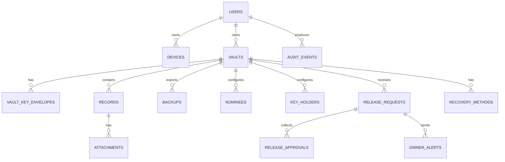

# OS-One Vault Data + API Draft

Date: 2026-05-03

## Data Classification

OS-One uses three data classes:

### Plaintext Metadata

Data the backend may read to operate the product:

- User account email.
- Device labels and public keys.
- Vault ID.
- Record ID.
- Record category.
- Record type.
- Review state.
- Release visibility.
- Revision.
- Encrypted payload size.
- Nominee and key-holder identities.
- Release request state.
- Audit event metadata.

Plaintext metadata must be minimized. Anything not needed for routing, sync, release, or audit should be encrypted.

### Encrypted Payload

Data encrypted on client before storage:

- Record title.
- Record fields.
- Sensitive values.
- Family notes.
- Attachment manifest details.
- Emergency package contents.
- Backup contents.

### Never Stored

Data OS-One must not store:

- Vault phrase.
- Recovery key plaintext.
- Vault master key plaintext.
- Passphrase-derived key.
- Decrypted record contents.
- Decrypted attachment contents.
- Full OCR text from private documents unless encrypted inside user vault.

## Entities And Relationships



## DB Tables / Entities

### `users`

Purpose: account identity and service access.

Security sensitivity: high metadata sensitivity, no vault plaintext.

Fields:

| Field | Type | Class | Notes |
| --- | --- | --- | --- |
| `id` | uuid | plaintext metadata | Primary key |
| `email` | citext | plaintext metadata | Login and alerts |
| `email_verified_at` | timestamptz | plaintext metadata | Verification state |
| `display_name` | text | plaintext metadata | UI display |
| `auth_provider` | text | plaintext metadata | `passkey`; password fallback may exist for account access only |
| `mfa_enabled` | boolean | plaintext metadata | Account security state |
| `created_at` | timestamptz | plaintext metadata | Account creation |
| `updated_at` | timestamptz | plaintext metadata | Account update |
| `disabled_at` | timestamptz | plaintext metadata | Account disabled state |

### `devices`

Purpose: trusted device lifecycle and sync authorization.

Security sensitivity: high, can affect account abuse.

Fields:

| Field | Type | Class | Notes |
| --- | --- | --- | --- |
| `id` | uuid | plaintext metadata | Primary key |
| `user_id` | uuid | plaintext metadata | Owner |
| `label` | text | plaintext metadata | User-visible device label |
| `platform` | text | plaintext metadata | `web`, `mac`, `windows`, `ios`, `android` |
| `public_key` | text | plaintext metadata | Device signing public key |
| `trusted_at` | timestamptz | plaintext metadata | Trust start |
| `revoked_at` | timestamptz | plaintext metadata | Trust end |
| `last_seen_at` | timestamptz | plaintext metadata | Activity |
| `risk_state` | text | plaintext metadata | `normal`, `new_location`, `suspicious` |

### `vaults`

Purpose: top-level encrypted vault container.

Security sensitivity: high metadata sensitivity.

Fields:

| Field | Type | Class | Notes |
| --- | --- | --- | --- |
| `id` | uuid | plaintext metadata | Primary key |
| `user_id` | uuid | plaintext metadata | Owner |
| `status` | text | plaintext metadata | `active`, `locked`, `disabled`, `deleted` |
| `schema_version` | integer | plaintext metadata | Client compatibility |
| `crypto_version` | integer | plaintext metadata | Crypto envelope version |
| `created_at` | timestamptz | plaintext metadata | Created |
| `updated_at` | timestamptz | plaintext metadata | Updated |

### `vault_key_envelopes`

Purpose: wrapped vault master keys for passphrase, recovery key, and trusted device unlock.

Security sensitivity: critical. Compromise still requires phrase/recovery/device secret, but envelopes are key material.

Fields:

| Field | Type | Class | Notes |
| --- | --- | --- | --- |
| `id` | uuid | plaintext metadata | Primary key |
| `vault_id` | uuid | plaintext metadata | Parent vault |
| `type` | text | plaintext metadata | `passphrase`, `recovery_key`, `device` |
| `device_id` | uuid | plaintext metadata | Required for device envelope |
| `kdf` | jsonb | plaintext metadata | Algorithm, memory, iterations, salt |
| `wrapped_key` | jsonb | encrypted key envelope | Encrypted vault master key |
| `created_at` | timestamptz | plaintext metadata | Created |
| `revoked_at` | timestamptz | plaintext metadata | Revoked |

### `records`

Purpose: encrypted life record with minimal metadata for navigation and release setup.

Security sensitivity: critical.

Fields:

| Field | Type | Class | Notes |
| --- | --- | --- | --- |
| `id` | uuid | plaintext metadata | Stable ID |
| `vault_id` | uuid | plaintext metadata | Parent vault |
| `category` | text | plaintext metadata | `identity`, `money`, `access`, `insurance`, `property`, `instructions` |
| `record_type` | text | plaintext metadata | `bank_account`, `identity_document`, etc. |
| `release_visibility` | text | plaintext metadata | `private`, `emergency_enabled`, `needs_review` |
| `review_state` | text | plaintext metadata | `current`, `needs_review`, `incomplete` |
| `revision` | integer | plaintext metadata | Sync conflict control |
| `encrypted_payload` | jsonb | encrypted payload | Title, fields, notes, sensitive values |
| `payload_hash` | text | plaintext metadata | Integrity/check reference |
| `created_at` | timestamptz | plaintext metadata | Created |
| `updated_at` | timestamptz | plaintext metadata | Updated |
| `deleted_at` | timestamptz | plaintext metadata | Soft delete |

### `attachments`

Purpose: encrypted file objects linked to records or emergency packages.

Security sensitivity: critical.

Fields:

| Field | Type | Class | Notes |
| --- | --- | --- | --- |
| `id` | uuid | plaintext metadata | Primary key |
| `vault_id` | uuid | plaintext metadata | Parent vault |
| `record_id` | uuid | plaintext metadata | Linked record |
| `object_key` | text | plaintext metadata | Blob storage key |
| `content_type` | text | plaintext metadata | General MIME type |
| `size_bytes` | bigint | plaintext metadata | Encrypted object size |
| `encrypted_manifest` | jsonb | encrypted payload | Filename, preview metadata, notes |
| `checksum` | text | plaintext metadata | Encrypted object checksum |
| `created_at` | timestamptz | plaintext metadata | Created |
| `deleted_at` | timestamptz | plaintext metadata | Deleted |

### `backups`

Purpose: encrypted backup snapshots.

Security sensitivity: critical encrypted payload.

Fields:

| Field | Type | Class | Notes |
| --- | --- | --- | --- |
| `id` | uuid | plaintext metadata | Primary key |
| `vault_id` | uuid | plaintext metadata | Parent vault |
| `storage_mode` | text | plaintext metadata | `downloaded`, `osone_hosted`, `user_cloud` |
| `manifest_version` | integer | plaintext metadata | Backup format |
| `encrypted_manifest` | jsonb | encrypted payload | Record and attachment map |
| `object_key` | text | plaintext metadata | Hosted backup blob if applicable |
| `size_bytes` | bigint | plaintext metadata | Encrypted size |
| `created_at` | timestamptz | plaintext metadata | Created |

### `nominees`

Purpose: owner-selected Main Nominee.

Security sensitivity: high metadata sensitivity.

Fields:

| Field | Type | Class | Notes |
| --- | --- | --- | --- |
| `id` | uuid | plaintext metadata | Primary key |
| `vault_id` | uuid | plaintext metadata | Owner vault |
| `user_id` | uuid | plaintext metadata | Nominee account when accepted |
| `email` | citext | plaintext metadata | Invite and alert identity |
| `display_name` | text | plaintext metadata | Display |
| `status` | text | plaintext metadata | `invited`, `accepted`, `removed` |
| `can_see_key_holders` | boolean | plaintext metadata | Owner choice |
| `created_at` | timestamptz | plaintext metadata | Created |
| `accepted_at` | timestamptz | plaintext metadata | Accepted |
| `removed_at` | timestamptz | plaintext metadata | Removed |

### `key_holders`

Purpose: independent release approvers.

Security sensitivity: high metadata sensitivity.

Fields:

| Field | Type | Class | Notes |
| --- | --- | --- | --- |
| `id` | uuid | plaintext metadata | Primary key |
| `vault_id` | uuid | plaintext metadata | Owner vault |
| `user_id` | uuid | plaintext metadata | Key-holder account when accepted |
| `email` | citext | plaintext metadata | Invite |
| `display_name` | text | plaintext metadata | Display |
| `status` | text | plaintext metadata | `invited`, `accepted`, `removed` |
| `public_key` | text | plaintext metadata | Approval signing key if used |
| `created_at` | timestamptz | plaintext metadata | Created |
| `accepted_at` | timestamptz | plaintext metadata | Accepted |
| `removed_at` | timestamptz | plaintext metadata | Removed |

### `emergency_packages`

Purpose: encrypted owner-approved emergency package, separate from full vault.

Security sensitivity: critical.

Fields:

| Field | Type | Class | Notes |
| --- | --- | --- | --- |
| `id` | uuid | plaintext metadata | Primary key |
| `vault_id` | uuid | plaintext metadata | Owner vault |
| `policy_version` | integer | plaintext metadata | Release policy version |
| `record_count` | integer | plaintext metadata | Count only |
| `encrypted_payload` | jsonb | encrypted payload | Emergency records only |
| `release_key_envelope` | jsonb | encrypted key envelope | Opens only after policy completion |
| `created_at` | timestamptz | plaintext metadata | Created |
| `revoked_at` | timestamptz | plaintext metadata | Revoked |

### `release_requests`

Purpose: state machine for nominee emergency access.

Security sensitivity: high.

Fields:

| Field | Type | Class | Notes |
| --- | --- | --- | --- |
| `id` | uuid | plaintext metadata | Primary key |
| `vault_id` | uuid | plaintext metadata | Owner vault |
| `nominee_id` | uuid | plaintext metadata | Requesting nominee |
| `emergency_package_id` | uuid | plaintext metadata | Package being requested |
| `state` | text | plaintext metadata | State machine value |
| `reason` | text | plaintext metadata | Nominee-provided reason, no secrets |
| `required_approvals` | integer | plaintext metadata | Default 3 |
| `total_key_holders` | integer | plaintext metadata | Default 5 |
| `hold_started_at` | timestamptz | plaintext metadata | Hold start |
| `hold_expires_at` | timestamptz | plaintext metadata | Hold expiry |
| `cancelled_at` | timestamptz | plaintext metadata | Owner cancel |
| `approved_at` | timestamptz | plaintext metadata | Release approved |
| `created_at` | timestamptz | plaintext metadata | Created |
| `updated_at` | timestamptz | plaintext metadata | Updated |

States:

- `draft`
- `identity_verification_required`
- `awaiting_key_holder_approval`
- `threshold_met_hold_pending`
- `owner_cancelled`
- `expired`
- `approved`
- `emergency_session_active`
- `closed`
- `abuse_review`

### `release_approvals`

Purpose: key-holder approval records.

Security sensitivity: high.

Fields:

| Field | Type | Class | Notes |
| --- | --- | --- | --- |
| `id` | uuid | plaintext metadata | Primary key |
| `release_request_id` | uuid | plaintext metadata | Parent request |
| `key_holder_id` | uuid | plaintext metadata | Approver |
| `decision` | text | plaintext metadata | `approved`, `declined`, `revoked` |
| `signed_statement` | jsonb | plaintext metadata | Signature over request facts |
| `created_at` | timestamptz | plaintext metadata | Created |

### `owner_alerts`

Purpose: owner warning delivery during release request.

Security sensitivity: medium to high metadata sensitivity.

Fields:

| Field | Type | Class | Notes |
| --- | --- | --- | --- |
| `id` | uuid | plaintext metadata | Primary key |
| `release_request_id` | uuid | plaintext metadata | Parent request |
| `channel` | text | plaintext metadata | `email`, `push`, `sms` |
| `scheduled_for` | timestamptz | plaintext metadata | Send target |
| `sent_at` | timestamptz | plaintext metadata | Sent time |
| `delivery_state` | text | plaintext metadata | `pending`, `sent`, `failed` |
| `provider_message_id` | text | plaintext metadata | Provider reference |

### `audit_events`

Purpose: append-only security and product audit log.

Security sensitivity: high; must not include secrets.

Fields:

| Field | Type | Class | Notes |
| --- | --- | --- | --- |
| `id` | uuid | plaintext metadata | Primary key |
| `user_id` | uuid | plaintext metadata | Actor if known |
| `vault_id` | uuid | plaintext metadata | Related vault |
| `actor_type` | text | plaintext metadata | `owner`, `nominee`, `key_holder`, `system` |
| `action` | text | plaintext metadata | Event name |
| `entity_type` | text | plaintext metadata | `record`, `release_request`, etc. |
| `entity_id` | uuid | plaintext metadata | Entity reference |
| `result` | text | plaintext metadata | `success`, `failure`, `blocked` |
| `risk_context` | jsonb | plaintext metadata | IP/device/risk flags, no secrets |
| `created_at` | timestamptz | plaintext metadata | Event time |

### `recovery_methods`

Purpose: recovery key and future recovery options.

Security sensitivity: critical.

Fields:

| Field | Type | Class | Notes |
| --- | --- | --- | --- |
| `id` | uuid | plaintext metadata | Primary key |
| `vault_id` | uuid | plaintext metadata | Parent vault |
| `type` | text | plaintext metadata | `recovery_key` |
| `status` | text | plaintext metadata | `active`, `revoked`, `used` |
| `wrapped_key_envelope_id` | uuid | plaintext metadata | Links key envelope |
| `created_at` | timestamptz | plaintext metadata | Created |
| `last_used_at` | timestamptz | plaintext metadata | Last used |
| `revoked_at` | timestamptz | plaintext metadata | Revoked |

## API Endpoints

All APIs require account authentication unless explicitly stated. Authentication proves account identity only. It never decrypts vault data.

### Auth And Account

#### `POST /api/v1/auth/register`

Purpose: create account.

Request:

```json
{
  "email": "owner@example.com",
  "displayName": "Aarav Mehta"
}
```

Response:

```json
{
  "userId": "uuid",
  "next": "verify_email_or_create_passkey"
}
```

Plaintext metadata: email, display name.

Encrypted payload: none.

#### `POST /api/v1/auth/session`

Purpose: create authenticated account session.

Request:

```json
{
  "email": "owner@example.com",
  "authenticatorResponse": {
    "type": "passkey_assertion"
  }
}
```

Response:

```json
{
  "sessionId": "opaque",
  "userId": "uuid",
  "mfaRequired": false
}
```

Plaintext metadata: auth challenge metadata.

Encrypted payload: none.

### Vault

#### `POST /api/v1/vaults`

Purpose: create vault container and store wrapped key envelopes.

Request:

```json
{
  "schemaVersion": 1,
  "cryptoVersion": 1,
  "keyEnvelopes": [
    {
      "type": "passphrase",
      "kdf": {
        "name": "argon2id",
        "memoryKiB": 65536,
        "iterations": 3,
        "parallelism": 1,
        "salt": "base64"
      },
      "wrappedKey": {
        "algorithm": "AES-256-GCM",
        "iv": "base64",
        "ciphertext": "base64"
      }
    }
  ]
}
```

Response:

```json
{
  "vaultId": "uuid",
  "createdAt": "2026-05-03T00:00:00Z"
}
```

Plaintext metadata: schema version, crypto version, envelope type, KDF parameters.

Encrypted payload: wrapped vault key only.

#### `GET /api/v1/vaults/{vaultId}/sync-state`

Purpose: fetch encrypted sync manifest.

Response:

```json
{
  "vaultId": "uuid",
  "records": [
    {
      "id": "uuid",
      "category": "identity",
      "recordType": "identity_document",
      "releaseVisibility": "emergency_enabled",
      "reviewState": "current",
      "revision": 4,
      "updatedAt": "2026-05-03T00:00:00Z"
    }
  ],
  "attachments": [
    {
      "id": "uuid",
      "recordId": "uuid",
      "contentType": "application/pdf",
      "sizeBytes": 83021
    }
  ]
}
```

Plaintext metadata: minimal sync/navigation fields.

Encrypted payload: none in manifest response.

### Records

#### `PUT /api/v1/vaults/{vaultId}/records/{recordId}`

Purpose: create or update encrypted record.

Request:

```json
{
  "category": "money",
  "recordType": "bank_account",
  "releaseVisibility": "emergency_enabled",
  "reviewState": "current",
  "baseRevision": 2,
  "encryptedPayload": {
    "algorithm": "AES-256-GCM",
    "iv": "base64",
    "ciphertext": "base64"
  },
  "payloadHash": "sha256-base64"
}
```

Response:

```json
{
  "recordId": "uuid",
  "revision": 3,
  "updatedAt": "2026-05-03T00:00:00Z"
}
```

Plaintext metadata: category, type, release visibility, review state, revision.

Encrypted payload: title, fields, sensitive values, notes.

#### `GET /api/v1/vaults/{vaultId}/records/{recordId}`

Purpose: fetch encrypted record envelope.

Response:

```json
{
  "id": "uuid",
  "category": "money",
  "recordType": "bank_account",
  "releaseVisibility": "emergency_enabled",
  "reviewState": "current",
  "revision": 3,
  "encryptedPayload": {
    "algorithm": "AES-256-GCM",
    "iv": "base64",
    "ciphertext": "base64"
  },
  "updatedAt": "2026-05-03T00:00:00Z"
}
```

#### `DELETE /api/v1/vaults/{vaultId}/records/{recordId}`

Purpose: soft-delete record.

Response:

```json
{
  "recordId": "uuid",
  "deletedAt": "2026-05-03T00:00:00Z"
}
```

### Attachments

#### `POST /api/v1/vaults/{vaultId}/attachments/upload-url`

Purpose: create signed upload URL for encrypted attachment bytes.

Request:

```json
{
  "recordId": "uuid",
  "contentType": "application/pdf",
  "sizeBytes": 83021,
  "checksum": "sha256-base64",
  "encryptedManifest": {
    "algorithm": "AES-256-GCM",
    "iv": "base64",
    "ciphertext": "base64"
  }
}
```

Response:

```json
{
  "attachmentId": "uuid",
  "uploadUrl": "https://storage.example/signed-put",
  "objectKey": "vaults/uuid/attachments/uuid"
}
```

Plaintext metadata: record ID, MIME type, encrypted size, checksum.

Encrypted payload: filename, preview notes, attachment manifest.

#### `POST /api/v1/vaults/{vaultId}/attachments/{attachmentId}/complete`

Purpose: mark encrypted upload complete.

Response:

```json
{
  "attachmentId": "uuid",
  "state": "stored"
}
```

#### `GET /api/v1/vaults/{vaultId}/attachments/{attachmentId}/download-url`

Purpose: return signed download URL for encrypted bytes.

Response:

```json
{
  "attachmentId": "uuid",
  "downloadUrl": "https://storage.example/signed-get",
  "expiresInSeconds": 300
}
```

### Recovery

#### `POST /api/v1/vaults/{vaultId}/recovery-methods`

Purpose: store recovery key envelope.

Request:

```json
{
  "type": "recovery_key",
  "keyEnvelope": {
    "type": "recovery_key",
    "kdf": {
      "name": "argon2id",
      "memoryKiB": 65536,
      "iterations": 3,
      "parallelism": 1,
      "salt": "base64"
    },
    "wrappedKey": {
      "algorithm": "AES-256-GCM",
      "iv": "base64",
      "ciphertext": "base64"
    }
  }
}
```

Response:

```json
{
  "recoveryMethodId": "uuid",
  "status": "active"
}
```

Never send recovery key plaintext.

#### `POST /api/v1/vaults/{vaultId}/recovery-methods/{id}/used`

Purpose: record recovery key use after successful client unwrap.

Response:

```json
{
  "recoveryMethodId": "uuid",
  "lastUsedAt": "2026-05-03T00:00:00Z"
}
```

### Backup

#### `POST /api/v1/vaults/{vaultId}/backups`

Purpose: register hosted encrypted backup.

Request:

```json
{
  "storageMode": "osone_hosted",
  "manifestVersion": 1,
  "encryptedManifest": {
    "algorithm": "AES-256-GCM",
    "iv": "base64",
    "ciphertext": "base64"
  },
  "sizeBytes": 1438201
}
```

Response:

```json
{
  "backupId": "uuid",
  "uploadUrl": "https://storage.example/signed-put",
  "createdAt": "2026-05-03T00:00:00Z"
}
```

### Release Setup

#### `PUT /api/v1/vaults/{vaultId}/release-policy`

Purpose: store nominee, key-holder, threshold, alert, and hold rules.

Request:

```json
{
  "mainNominee": {
    "email": "nominee@example.com",
    "displayName": "Nisha Mehta",
    "canSeeKeyHolders": true
  },
  "keyHolders": [
    {
      "email": "holder1@example.com",
      "displayName": "Rohan Mehta"
    }
  ],
  "requiredApprovals": 3,
  "holdDays": 14,
  "ownerAlertsPerDay": 2
}
```

Response:

```json
{
  "policyVersion": 3,
  "readiness": "incomplete",
  "missing": ["four_more_key_holders"]
}
```

Plaintext metadata: nominee/key-holder identities, policy numbers.

Encrypted payload: none.

#### `POST /api/v1/vaults/{vaultId}/emergency-packages`

Purpose: upload encrypted emergency package.

Request:

```json
{
  "policyVersion": 3,
  "recordCount": 8,
  "encryptedPayload": {
    "algorithm": "AES-256-GCM",
    "iv": "base64",
    "ciphertext": "base64"
  },
  "releaseKeyEnvelope": {
    "algorithm": "threshold-release-v1",
    "ciphertext": "base64"
  }
}
```

Response:

```json
{
  "emergencyPackageId": "uuid",
  "state": "active"
}
```

Encrypted payload: emergency-enabled record contents only.

Normal vault contents are not included.

### Release Request

#### `POST /api/v1/release-requests`

Purpose: nominee starts emergency release request.

Request:

```json
{
  "vaultId": "uuid",
  "nomineeId": "uuid",
  "reason": "Owner is medically incapacitated and family needs insurance and bank access instructions."
}
```

Response:

```json
{
  "releaseRequestId": "uuid",
  "state": "identity_verification_required",
  "next": "complete_nominee_verification"
}
```

#### `POST /api/v1/release-requests/{id}/verify-nominee`

Purpose: complete nominee identity verification.

Response:

```json
{
  "releaseRequestId": "uuid",
  "state": "awaiting_key_holder_approval"
}
```

#### `POST /api/v1/release-requests/{id}/approvals`

Purpose: key holder approves or declines request.

Request:

```json
{
  "keyHolderId": "uuid",
  "decision": "approved",
  "signedStatement": {
    "algorithm": "Ed25519",
    "signature": "base64"
  }
}
```

Response:

```json
{
  "releaseRequestId": "uuid",
  "state": "threshold_met_hold_pending",
  "approvalCount": 3,
  "holdExpiresAt": "2026-05-17T00:00:00Z"
}
```

#### `POST /api/v1/release-requests/{id}/cancel`

Purpose: owner cancels release request.

Request:

```json
{
  "reason": "Owner confirmed this request is not valid."
}
```

Response:

```json
{
  "releaseRequestId": "uuid",
  "state": "owner_cancelled",
  "cancelledAt": "2026-05-03T00:00:00Z"
}
```

#### `POST /api/v1/release-requests/{id}/emergency-session`

Purpose: create emergency session after hold expiry.

Response:

```json
{
  "releaseRequestId": "uuid",
  "state": "emergency_session_active",
  "emergencySessionId": "uuid",
  "expiresAt": "2026-05-04T00:00:00Z"
}
```

#### `GET /api/v1/emergency-sessions/{id}/package`

Purpose: nominee fetches emergency package envelope.

Response:

```json
{
  "emergencyPackageId": "uuid",
  "encryptedPayload": {
    "algorithm": "AES-256-GCM",
    "iv": "base64",
    "ciphertext": "base64"
  },
  "releaseKeyEnvelope": {
    "algorithm": "threshold-release-v1",
    "ciphertext": "base64"
  }
}
```

This endpoint returns emergency package data only. It must not return full vault records.

### Audit

#### `GET /api/v1/vaults/{vaultId}/audit-events`

Purpose: owner-visible audit history.

Response:

```json
{
  "events": [
    {
      "id": "uuid",
      "actorType": "owner",
      "action": "record.revealed",
      "entityType": "record",
      "entityId": "uuid",
      "result": "success",
      "createdAt": "2026-05-03T00:00:00Z"
    }
  ]
}
```

Audit responses must not contain sensitive values.

## Background Jobs

### `release-owner-alert-scheduler`

Runs every 30 minutes.

Responsibilities:

- Find release requests in `threshold_met_hold_pending`.
- Create missing owner alert rows based on twice-daily rule.
- Avoid duplicate alerts.

### `release-owner-alert-sender`

Runs every 5 minutes.

Responsibilities:

- Send due owner alerts.
- Mark delivery state.
- Record audit event.

### `release-hold-expiry-worker`

Runs every 5 minutes.

Responsibilities:

- Find hold-pending requests past `hold_expires_at`.
- Verify request was not cancelled, expired, or flagged for abuse review.
- Mark approved.
- Create emergency session.
- Notify nominee and owner.

### `release-abuse-monitor`

Runs continuously or every 15 minutes.

Responsibilities:

- Detect repeated failed nominee verification.
- Detect too many requests.
- Detect unusual device or IP signals.
- Move request to `abuse_review` when risk is high.

### `backup-integrity-checker`

Runs daily for hosted backups.

Responsibilities:

- Verify encrypted object exists.
- Verify stored size and checksum.
- Never decrypt backup contents.

### `audit-retention-worker`

Runs daily.

Responsibilities:

- Enforce retention policy.
- Preserve owner-visible security events.
- Remove operational logs that are not required.

## Event Log Model

Event names:

- `account.created`
- `account.login_succeeded`
- `account.login_failed`
- `device.trusted`
- `device.revoked`
- `vault.created`
- `vault.unlocked_local`
- `record.created`
- `record.updated`
- `record.deleted`
- `record.revealed`
- `attachment.added`
- `attachment.deleted`
- `backup.exported`
- `backup.restored`
- `recovery_key.created`
- `recovery_key.used`
- `release_policy.updated`
- `emergency_package.created`
- `release_request.created`
- `release_request.nominee_verified`
- `release_request.key_holder_approved`
- `release_request.threshold_met`
- `owner_alert.sent`
- `release_request.cancelled_by_owner`
- `release_request.approved_after_hold`
- `emergency_session.created`
- `emergency_package.viewed`
- `emergency_package.exported`

Event constraints:

- `action` must come from the event name allowlist.
- `entity_id` must be a UUID.
- `risk_context` may include IP country, device ID, user agent family, and risk flags.
- `risk_context` must not include passwords, phrases, recovery keys, record text, OCR text, or document contents.

## Beta Versus Production Truth

### Beta Real Enough

- Local encrypted prototype vault.
- Local backup export/import if encrypted before save.
- Record structure, categories, attachments, reveal/hide masking, and Life Map workspace.
- Capture as draft review when labelled local heuristic extraction.

### Beta Simulated But Acceptable

- Nominee/key-holder setup UI.
- Release countdown preview.
- Owner alert preview.
- Emergency access preview.

The UI must label these as local simulations.

### Production Required Before Real Sensitive Data

- Argon2id production KDF.
- Native secure storage for desktop.
- Passkey account auth.
- Device registration and revocation.
- Backend encrypted sync.
- Real emergency package creation.
- Real release workflow backend.
- Real notification delivery.
- Append-only audit service.
- Independent security review.
- Signed app builds and update channel.

### Must Never Be Simulated As Real

- Production emergency release enforcement.
- Owner alert delivery.
- Nominee identity verification.
- Key-holder approval verification.
- Server-side recovery.
- Backend decryption resistance.
- Cloud sync safety.
